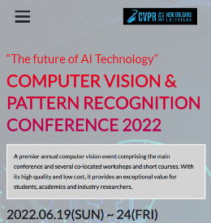
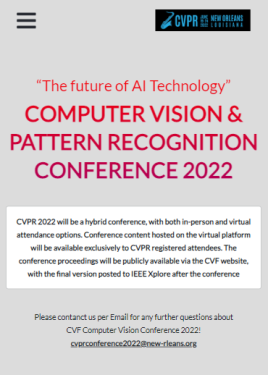

# First Capstone Project

A conference-event app that allows users to view event timelines, plans, stakeholders, and feaures topics and speakers. Built with HTLM, CSS, Bootstrap, and JavaScript.


## Built With

- html
- css
- Bootstrap (v5)
- JavaScript


## Live Demo

In order to know how the project app functions, please watch this
[loom video](https://www.loom.com/share/d6c73017728c483488f6a985fd6eaff5)


## Screenshots

### Main Page



### About Page




## Getting Started

To get a copy of this project running on your local computer, do the followings:

### Prerequisites

- Must have a working computer
- A Web-Browser installed (Chrome - Recommended)

### Setup

- Install _VSCode_ ([link](https://code.visualstudio.com/download))
- Clone this project repository on your local computer. ([link](../../))
- Open the project directory with _VSCode_

### Install

Open _Terminal/Shell_ inside your _VSCode_ and run
  ```
    npm install --force
  ```

### Run tests

- For _hint_ tests, run
  ```
    npm run lint:hint
  ```
- For _style_ tests, run
  ```
    npm run lint:style
  ```
- For _eslint_ tests, run
  ```
    npm run lint:es
  ```

### Deployment

Please visit [first-capstone-project](https://sntakirutimana72.github.io/first-capstone-project/)


## Authors

👤 **Steve**

- GitHub: [@sntakirutimana72](../../../)

## 🤝 Contributing

Contributions, issues, and feature requests are welcome!

Feel free to check the [issues page](../../issues/).

## Show your support

Give a ⭐️ if you like this project!

## Acknowledgments

- Fellow Micronauts
- _**Cindy Shin in Behance**_ ~ The original designer of the template. 
